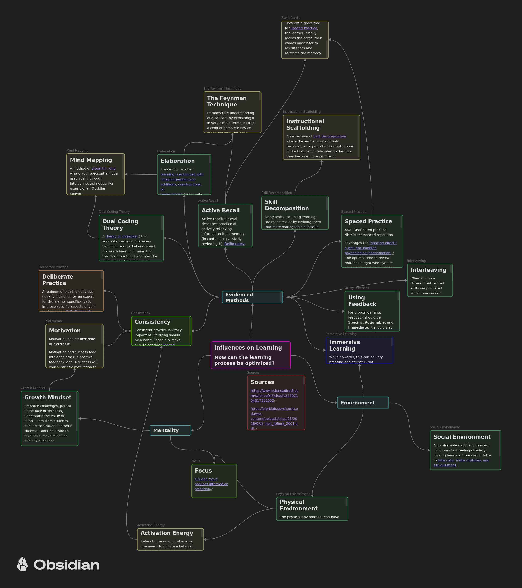

# Learning Optimization Mindmap

## Project Overview
Some formatted research on the learning process, and in particular the best ways to learn and teach. Made in the process of developing my Personal Knowledge Management system.

## Viewing
To properly view the mindmap (so that you can scroll down on longer entries), use Obsidian, an app that can be found [here](https://obsidian.md/). However, the corresponding markdown files already contain that information, and those can be viewed with any means of viewing text/markdown files, including the github website.

## References
See [Sources.md](Sources.md)
